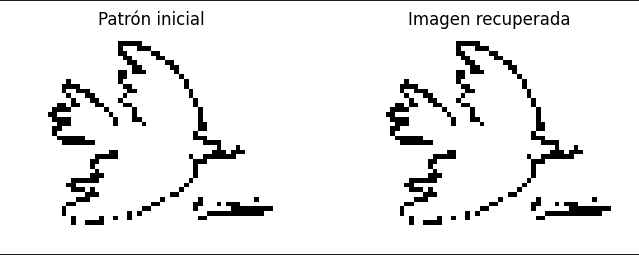
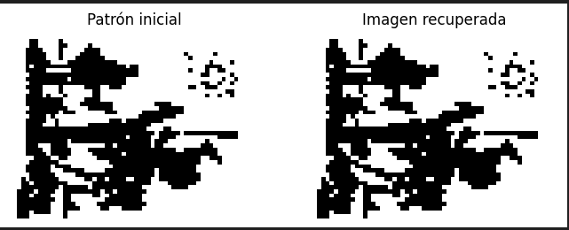
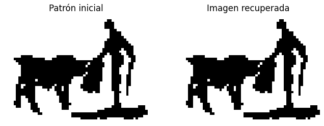
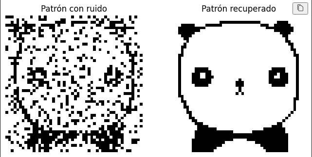
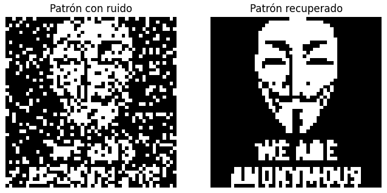
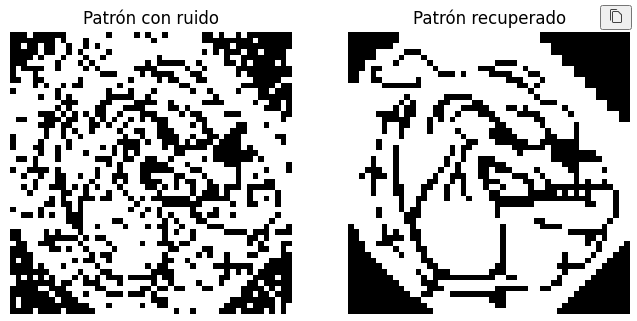
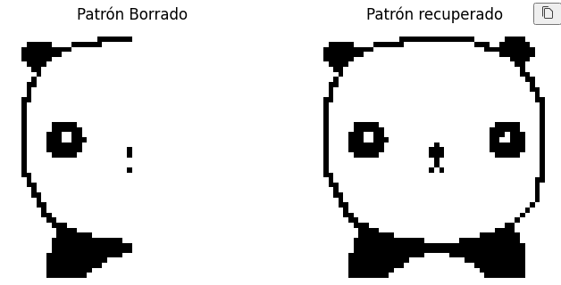
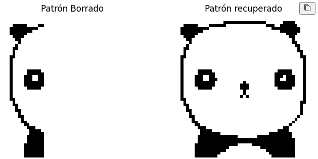
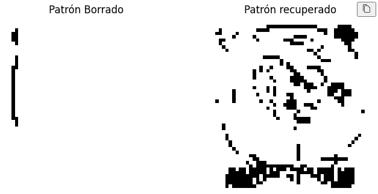

# Redes-Neuronales - TP1

## Tabla de Contenidos
- [Introducción](#Introducción)
- [Red recurrente](#Red-recurrente)
- [Modelo de Hopfield](#Modelo-de-Holpfield)
- [Trabajo Práctico](#Trabajo-Práctico)
    - [Punto a](#a--verifique-si-la-red-aprendió-las-imágenes-enseñadas)
    - [Punto b](#b--evalúe-la-evolución-de-la-red-al-presentarle-versiones-alteradas-de-las-imágenesa-prendidas-agregado-de-ruido-elementos-borrados-o-agregados)
    - [Punto c]

## Introducción
### ¿Qué es una red neuronal biológica y como se imitan mediante algoritmos?
🧠 `Red neuronal biológica`: funciona con neuronas, impulsos eléctricos y sinapsis. Cada neurona decide si transmite una señal en función de la suma de sus entradas y la fuerza de las conexiones. El aprendizaje ocurre reforzando o debilitando esas conexiones.

💻 `Red neuronal artificial`: está compuesta por "nodos" o "neuronas artificiales" que realizan operaciones matemáticas simples.

Las redes neuronales artificiales imitan de manera muy simplificada la forma en que las redes biológicas procesan y aprenden información. No replican la complejidad del cerebro, pero toman la idea de "muchas unidades simples conectadas en red que, al trabajar juntas, generan comportamientos complejos".

Para que una red neuronal pueda funcionar correctamente necesita pasar por un proceso de entrenamiento, en el cual se ajustan los pesos de sus conexiones entre capas. Mediante la exposición a distintos conjuntos de datos, el sistema va perfeccionando su capacidad de aprendizaje, logrando que las neuronas artificiales reconozcan patrones y resuelvan problemas, ofreciendo respuestas que se asemejan a las de un ser humano.

## Red recurrente
Una red recurrente es aquella en donde las neuronas tienen conexiones que vuelven sobre sí mismas o hacia otras neuronas en la misma capa, lo que permite que el sistema “recuerde” estados anteriores.

La red de Hopfield es una de ellas. En la próxima sección se hace una introducción al modelo

## Modelo de Hopfield
El modelo de Hopfield, propuesto por John Hopfield en 1982, es una de las primeras arquitecturas de redes neuronales artificiales que buscó imitar el funcionamiento de la memoria en el cerebro

La idea principal es que la red pueda funcionar como una `memoria asociativa`:
- Durante el entrenamiento, se almacenan patrones en los pesos de la red.

- Cuando se le presenta un patrón incompleto o ruidoso, la red evoluciona dinámicamente hasta estabilizarse en el patrón correcto o en uno muy cercano.

#### Memoria asociativa
La memoria asociativa es la capacidad de un sistema de recordar información completa a partir de fragmentos o datos incompletos.
En el cerebro biológico sería, por ejemplo: ver solo una parte de una foto y aun así reconocer a la persona que aparece.

En una red de Hopfield, esta idea se implementa almacenando patrones en los pesos de las conexiones.

La memoria asociativa en Hopfield permite que la red actúe como un recordador de patrones, reconociendo información parcial y llevándola al patrón más parecido que ya tenía guardado.

## Trabajo Práctico
## Entrene una red de Hopfield ‘82 con las imágenes binarias disponibles en el campus.
### a- Verifique si la red aprendió las imágenes enseñadas.
Para probar esto, le presento a la red 3 imágenes del mismo tamaño y evalúo la convergencia de cada imagen.

La imagen recuperada es la misma que el patrón inicial. Por lo que podemos concluir que la red aprendió de los patrones enseñados.

### b- Evalúe la evolución de la red al presentarle versiones alteradas de las imágenesa prendidas: agregado de ruido, elementos borrados o agregados.

### Agregandole ruido a los patrones invirtiendo los bits
Para este punto elegí las imágenes de tamaño (50,50), les agregué diferentes grados de ruido y probé la red.
Elegí agregarle ruido invirtiendo bits de forma aleatoria.

Se puede ver que la red es bastante tolerante al ruido elegido, ya que logró converger a la imagen inicial en los 3 casos.

### Agregandole ruido a los patrones borrando diferentes porcentajes del patrón

Se puede observar que borrando hasta un 70% del patrón original la red converge de forma correcta.

#### 1- Borrando el 50% del patrón original

#### 2- Borrando el 70% del patrón original

#### 3- Borrando el 90% del patrón original

### c- Evalúe la existencia de estados espurios en la red: patrones inversos y combinaciones de un número impar de patrones.
#### Estados espurios

Una red de Hopfield es una red de memoria asociativa: entrena ciertos patrones ξμ como mínimos de energía.
Cuando a la red se le da una entrada ruidosa o incompleta, la dinámica baja la “energía” y cae en el mínimo más cercano es decir, recupera el patrón original.
Además de estos patrones entrenados, aparecen otros mínimos estables que no son patrones originales, a esos mínimos se los llama estados espurios.

#### Tipos de estados espurios
##### 1- Patrones inversos
Si ξμ es un patrón entrenado, su inverso -ξμ también puede ser un mínimo estable.
Por ejemplo: Si la red memorizó un panda, la red puede converger también en un "anti panda" todo invertido lo blaco/negro.
##### 2- Combinaciones de un número impar de patrones
Un estado espurio también puede ser una suma de k (número impar) estados enseñados:

`s=sign(ξμ1​+ξμ2​+⋯+ξμ2k+1​)`

Es decir, si se entrenó la red con tres imágenes distintas, la red puede generar una especie de mezcla híbrida de esas tres y tratar de recordarla como si fuera un patrón real.

Visualmente, esas combinaciones suelen parecer “fantasmas” de varios patrones mezclados.

