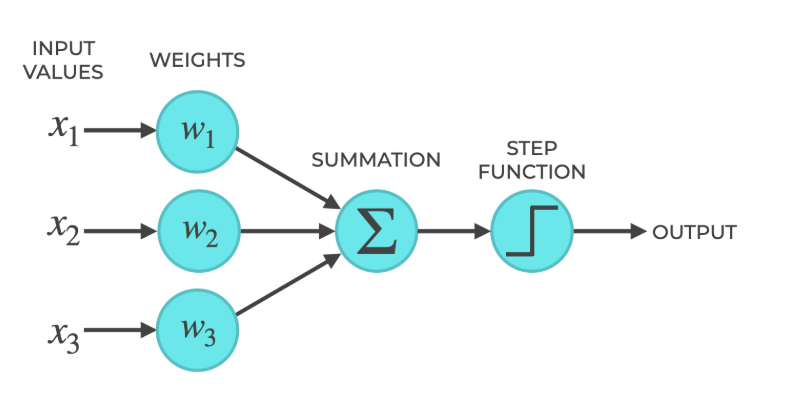
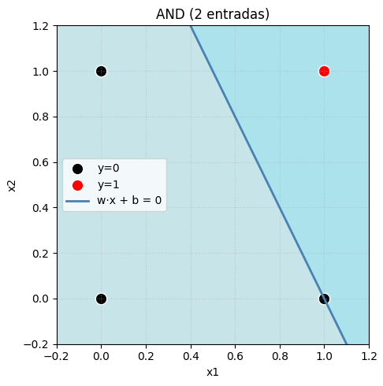
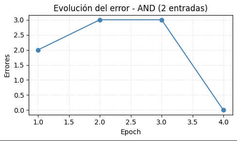
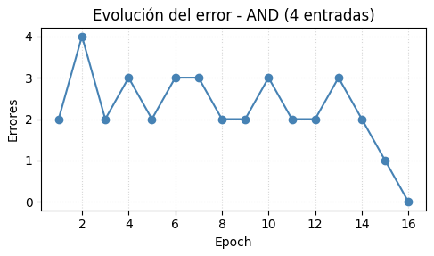
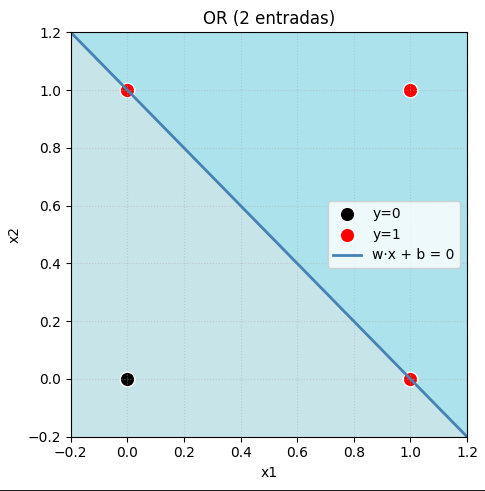
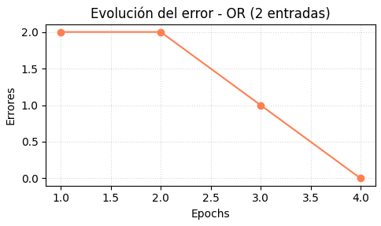
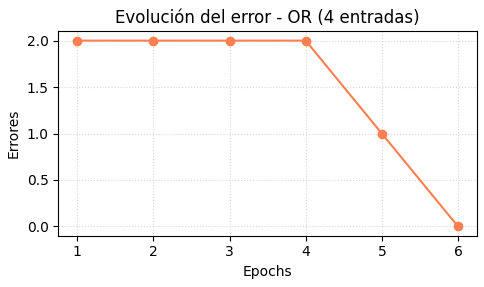

# Redes-Neuronales - TP2


|          |                   |
|---------------|------------------------|
| Nombre        | Camila Fernández Marchitelli     |
| Padrón          | 102515               |
| Año       | 2025 |
| Mail          | cfernandezm@fi.uba.ar    |

## Tabla de Contenidos
- [¿Qué es un perceptrón?](#que-es-un-perceptron)
- [¿Cuáles son los componentes de un perceptrón simple?](#cuales-son-los-componentes-de-un-perceptron-simple)
- [Aprendizaje de un perceptrón simple](#aprendizaje-de-un-perceptron-simple)
- [Ejercicios](#ejercicios)
     
    - [1) Implemente un perceptrón simple que aprenda la función lógica AND y la función lógica OR, de 2 y de 4 entradas. Muestre la evolución del error durante el entrenamiento. Para el caso de 2 dimensiones, grafique la recta discriminadora y todos los vectores de entrada de la red](#1-implemente-un-perceptrón-simple-que-aprenda-la-función-lógica-and-y-la-función-lógica-or-de-2-y-de-4-entradas-muestre-la-evolución-del-error-durante-el-entrenamiento-para-el-caso-de-2-dimensiones-grafique-la-recta-discriminadora-y-todos-los-vectores-de-entrada-de-la-red)
    - [2) Determine numéricamente cómo varía la capacidad del perceptrón simple en función
del número de patrones enseñados.](#2-determine-numericamente-como-varia-la-capacidad-del-perceptron-simple-en-funcion-del-numero-de-patrones-enseñados)


## ¿Qué es un perceptrón?
El perceptrón es la neurona artificial más simple para clasificación binaria. Toma un vector de características, calcula una combinación lineal y aplica una función de activación para decidir entre dos clases.
Es el modelo mas sencillo de una red neuronal artificial.
Fue creado en 1958 por Frank Rosenblatt y busca imitar de manera muy básica cómo funciona una neurona en el cerebro.

En palabras simples: es como una pequeña calculadora que toma decisiones, por ejemplo, si un mail es spam o no, según las características que reciba.

Un único perceptrón solo puede resolver problemas muy simples, donde los datos se puedan separar con una línea recta (problemas linealmente separables).

El perceptrón se define como una función $g: R^n\longrightarrow\lbrace-1.1\rbrace$, que asocia un vector (patrón de entrada) $X = (X_1, X_2,\ldots,X_n)^T\in R^n$ con $O\in\lbrace-1, 1\rbrace$ (patrón de salida deseada) de la forma $O=g(X)$.

## ¿Cuáles son los componentes de un perceptrón simple?



- **Patrón de entrada**: $X=(X_1,X_2,X_3,\ldots,X_n)$ donde $X_i\in\lbrace -1, 1\rbrace\;$ $1\leq i\leq n$.

- **Pesos sinápticos**: $\omega_{ij}$ representan el peso de la conexión de la neurona $j$ a la $i$ con $\omega_{ij}\neq\omega_{ji}$ con $1\leq i,j \leq n$.

- **Función de propagación (o entrada neta)**: Proporciona el valor del potencial postsináptico, $h_i$ de la neurona $i$-ésima, como la suma ponderada de las entradas $X_k$ (incluyendo $X_0=1$ para el sesgo) con los pesos sinápticos $\omega_{ik}$, es decir  $$h_i=\sum_{k=0}^{n}\omega_{ik}X_k$$

- **Función de activación**: $g(x)=sgn(x)$ determina la salida de la red, para así, obtener $O_i$ como   $$O_i=g(h_i)=g\Big(\sum_{k=0}^{n}\omega_{ik}X_{k}\Big)$$.

## Aprendizaje de un perceptrón simple
El entrenamiento del perceptrón es un ciclo corto que ajusta los pesos hasta que el modelo clasifica bien los ejemplos del conjunto de entrenamiento. El proceso se repite tantas veces como sea necesario:

1. Se entrega un ejemplo $(X, O)$ al perceptrón y se calcula la salida actual $g(X)$.
2. Se compara la salida con la etiqueta esperada $O$. Si acierta, no se hace nada.
3. Si se equivoca, se corrigen los pesos sumándole a cada uno una pequeña parte del error: $\omega_{ik} \leftarrow \omega_{ik} + \eta (O - g(X)) X_k$, donde $\eta$ es la tasa de aprendizaje (un número pequeño que controla qué tan grandes son los ajustes).

Así, cada error empuja los pesos en la dirección correcta. Cuando ya no hay errores (o el modelo deja de mejorar), se detiene el entrenamiento y el perceptrón queda listo para predecir.

## Ejercicios
### 1. Implemente un perceptrón simple que aprenda la función lógica AND y la función lógica OR, de 2 y de 4 entradas. Muestre la evolución del error durante el entrenamiento. Para el caso de 2 dimensiones, grafique la recta discriminadora y todos los vectores de entrada de la red.

### Función lógica AND con 2 entradas
Para probar la clase `Perceptron` elegí las siguientes entradas:
```
X = [[0, 0], [0, 1], [1, 0], [1, 1]]
Y = [0, 0, 0, 1]
```
La salida devuelta por el perceptrón fue la siguiente:

- Pesos finales: $w=[0.4,\;0.2]$
- Sesgo: $b\approx -0.4$
- Exactitud: $4/4 = 1.00$
- Converge en 4 epochs

| $x_1$ | $x_2$ | $g(X)$ | $y$ 
|-------|-------|--------|-----
| 0 | 0 | 0 | 0 | |
| 0 | 1 | 0 | 0 | |
| 1 | 0 | 0 | 0 | |
| 1 | 1 | 1 | 1 | |

La recta discriminadora correspondiente es $0.4\,x_1 + 0.2\,x_2 - 0.4 = 0$.

A continuación se muestra la recta graficada junto con los puntos elegidos para el and, donde los puntos negros representan la clase con etiqueta 0 (es donde la red debería devolver 0) y los puntos rojos representan la clase con etiqueta 1 (es donde la red debería devolver 1.)




### Función lógica AND con 4 entradas

Para extender la prueba a cuatro entradas utilicé las $2^4$ combinaciones posibles de bits y la etiqueta $y=1$ únicamente cuando todas las entradas valen 1. El perceptrón clasificó correctamente todos los patrones:

```
X = [
  [0, 0, 0, 0], [0, 0, 0, 1], [0, 0, 1, 0], [0, 0, 1, 1],
  [0, 1, 0, 0], [0, 1, 0, 1], [0, 1, 1, 0], [0, 1, 1, 1],
  [1, 0, 0, 0], [1, 0, 0, 1], [1, 0, 1, 0], [1, 0, 1, 1],
  [1, 1, 0, 0], [1, 1, 0, 1], [1, 1, 1, 0], [1, 1, 1, 1]
]
Y = [0, 0, 0, 0, 0, 0, 0, 0, 0, 0, 0, 0, 0, 0, 0, 1]
```
- Pesos finales: $w=[0.8,\,0.4,\,0.2,\,0.2]$
- Sesgo: $b\approx -1.6$
- Exactitud: $16/16 = 1.00$
- Converge en 16 epochs

| $x_1$ | $x_2$ | $x_3$ | $x_4$ | $g(X)$ | $y$ 
|-------|-------|-------|-------|--------|-----
| 0 | 0 | 0 | 0 | 0 | 0 |
| 0 | 0 | 0 | 1 | 0 | 0 |
| 0 | 0 | 1 | 0 | 0 | 0 | 
| 0 | 0 | 1 | 1 | 0 | 0 |
| 0 | 1 | 0 | 0 | 0 | 0 |
| 0 | 1 | 0 | 1 | 0 | 0 |
| 0 | 1 | 1 | 0 | 0 | 0 | 
| 0 | 1 | 1 | 1 | 0 | 0 |
| 1 | 0 | 0 | 0 | 0 | 0 |
| 1 | 0 | 0 | 1 | 0 | 0 |
| 1 | 0 | 1 | 0 | 0 | 0 | 
| 1 | 0 | 1 | 1 | 0 | 0 |
| 1 | 1 | 0 | 0 | 0 | 0 |
| 1 | 1 | 0 | 1 | 0 | 0 |
| 1 | 1 | 1 | 0 | 0 | 0 | 
| 1 | 1 | 1 | 1 | 1 | 1 |


### Evolución de los errores - AND 2 y 4 entradas


En el próximo gráfico se puede ver la evolución del error para del AND 2 entradas a lo largo del entrenamiento de perceptrón:
Tiene sentido que el primer epoch de un valor mas bajo que en las próximas, ya que los pesos arrancan en cero.
Como se puede observar, se tarda 4 ciclos en llegar al resultado real.



En este gráfico podemos ver la evolución del AND 4 entradas a lo largo de todo el entrenamiento, es bastante variante, supongo que la variación se debe a la cantidad de patrones que le ingreśe y que eso puede ir "desacomodando".



### Función lógica OR con 2 entradas

Para la función OR utilicé la misma base de entradas binarias que en el caso AND pero con etiquetas $y=[0,1,1,1]$.
El percetrón clasifica todos los casos correctamente

- Pesos finales: $w=[0.2,\;0.2]$
- Sesgo: $b\approx -0.2$
- Exactitud: $4/4 = 1.00$
- Converge en 4 epochs

| $x_1$ | $x_2$ | $g(X)$ | $y$ 
|-------|-------|--------|-----
| 0 | 0 | 0 | 0 | 
| 0 | 1 | 1 | 1 | 
| 1 | 0 | 1 | 1 | 
| 1 | 1 | 1 | 1 |

La recta discriminadora correspondiente es $0.2\,x_1 + 0.2\,x_2 - 0.2 = 0$, es decir, $x_1 + x_2 - 1 = 0$, que separa los casos con al menos una entrada igual a 1 de los que tienen ambas en 0.



### Función lógica OR con 4 entradas

Para el caso de cuatro entradas utilicé las mismas combinaciones binarias que en AND, pero con etiqueta 1 para cualquier patrón que contenga al menos un `1`. 

- Pesos finales: $w=[0.2,\,0.2,\,0.2,\,0.2]$
- Sesgo: $b\approx -0.2$
- Exactitud: $16/16 = 1.00$
- Converge en 6 epochs

| $x_1$ | $x_2$ | $x_3$ | $x_4$ | $g(X)$ | $y$ 
|-------|-------|-------|-------|--------|-----
| 0 | 0 | 0 | 0 | 0 | 0 |
| 0 | 0 | 0 | 1 | 1 | 1 |
| 0 | 0 | 1 | 0 | 1 | 1 | 
| 0 | 0 | 1 | 1 | 1 | 1 | 
| 0 | 1 | 0 | 0 | 1 | 1 | 
| 0 | 1 | 0 | 1 | 1 | 1 | 
| 0 | 1 | 1 | 0 | 1 | 1 | 
| 0 | 1 | 1 | 1 | 1 | 1 | 
| 1 | 0 | 0 | 0 | 1 | 1 | 
| 1 | 0 | 0 | 1 | 1 | 1 | 
| 1 | 0 | 1 | 0 | 1 | 1 | 
| 1 | 0 | 1 | 1 | 1 | 1 | 
| 1 | 1 | 0 | 0 | 1 | 1 | 
| 1 | 1 | 0 | 1 | 1 | 1 | 
| 1 | 1 | 1 | 0 | 1 | 1 | 
| 1 | 1 | 1 | 1 | 1 | 1 |


### Evolución de los errores - OR 2 y 4 entradas
En los próximos gráficos se muestran las evoluciones del error OR de 2 y 4 entradas, para ambos casos el comportamiento es el mismo: se ve que en las primeras epochs queda fijo en el mismo valor y a medida que los ciclos van avanzando el error va bajando hasta alcanzar el cero.





### . Determine numéricamente cómo varía la capacidad del perceptrón simple en función del número de patrones enseñados. 