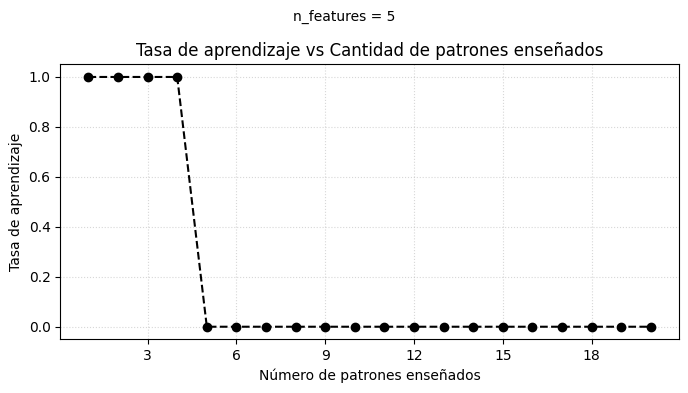
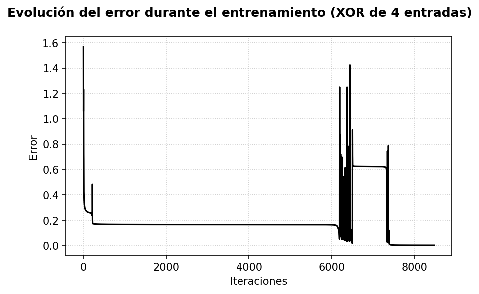
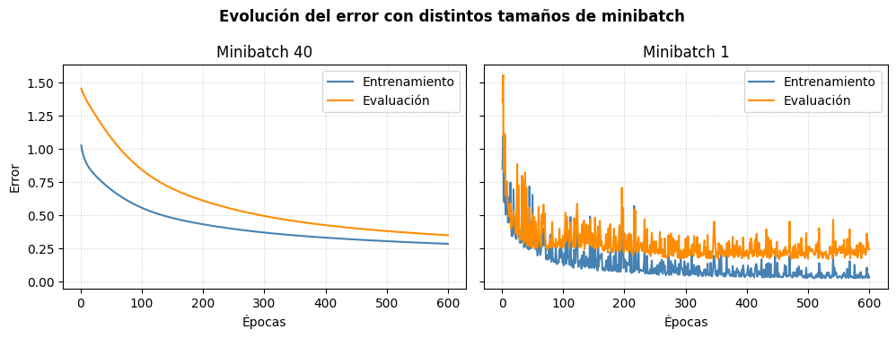

# Redes-Neuronales - TP2


|          |                   |
|---------------|------------------------|
| Nombre        | Camila Fernández Marchitelli     |
| Padrón          | 102515               |
| Año       | 2025 |
| Mail          | cfernandezm@fi.uba.ar    |

## Tabla de Contenidos
- [¿Qué es un perceptrón?](#que-es-un-perceptron)
- [¿Cuáles son los componentes de un perceptrón simple?](#cuales-son-los-componentes-de-un-perceptron-simple)
- [Aprendizaje de un perceptrón simple](#aprendizaje-de-un-perceptron-simple)
- [¿Qué es un perceptrón multicapa?](#que-es-un-percetron-multicapa)
- [¿Qué es una máquina restringida de Boltzmann (RBM)?](#que-es-una-maquina-restringida-de-boltzmann-(RBM))
- [¿Qué es una red convolucional (CNN)?](#que-es-una-red-convolucional-(CNN))
- [¿Qué es un autoencoder?](#que-es-un-autoencoder)
- [Ejercicios](#ejercicios)
     
    - [1) Implemente un perceptrón simple que aprenda la función lógica AND y la función lógica OR, de 2 y de 4 entradas. Muestre la evolución del error durante el entrenamiento. Para el caso de 2 dimensiones, grafique la recta discriminadora y todos los vectores de entrada de la red](#1-implemente-un-perceptrón-simple-que-aprenda-la-función-lógica-and-y-la-función-lógica-or-de-2-y-de-4-entradas-muestre-la-evolución-del-error-durante-el-entrenamiento-para-el-caso-de-2-dimensiones-grafique-la-recta-discriminadora-y-todos-los-vectores-de-entrada-de-la-red)
    - [2) Determine numéricamente cómo varía la capacidad del perceptrón simple en función
    del número de patrones enseñados.](#2-determine-numericamente-como-varia-la-capacidad-del-perceptron-simple-en-funcion-del-numero-de-patrones-enseñados)
    - [3) Implemente un perceptrón multicapa que aprenda la función lógica XOR de 2 y de 4 entradas (utilizando el algoritmo Backpropagation y actualizando en batch). Muestre cómo evoluciona el error durante el entrenamiento.](#3-implemente-un-perceptrón-multicapa-que-aprenda-la-función-lógica-XOR-de-2-y-de-4-entradas-(utilizando-el-algoritmo-Backpropagation-y-actualizando-en-batch)-muestre-cómo-evoluciona-el-error-durante-el-entrenamiento)
    - [4a) Implemente una red con aprendizaje Backpropagation que aprenda la función f(x,y,z)=sin(x)+cos(y)+z. Construya un conjunto de entrenamiento y uno de evaluación, y muestre la evolución del error de entrenamiento y de evaluación en función de las épocas.](#4a-implemente-una-red-con-aprendizaje-backpropagation-que-aprenda-la-función-fxyzsinxcosyz-construya-un-conjunto-de-entrenamiento-y-uno-de-evaluación-y-muestre-la-evolución-del-error-de-entrenamiento-y-de-evaluación-en-función-de-las-épocas)
    - [4b) Estudie la evolución de los errores durante el entrenamiento de una red con una capa oculta de 30 neuronas cuando el conjunto de entrenamiento contiene 40 muestras. ¿Que ocurre si el minibatch tiene tamaño 40? ¿Y si tiene tamaño 1?](#4b-estudie-la-evolución-de-los-errores-durante-el-entrenamiento-de-una-red-con-una-capa-oculta-de-30-neuronas-cuando-el-conjunto-de-entrenamiento-contiene-40-muestras-que-ocurre-si-el-minibatch-tiene-tamaño-40-y-si-tiene-tamaño-1)
     - [5) Siguiendo el trabajo de Hinton y Salakhutdinov (2006), entrene una máquina restringida de Boltzmann con imágenes de la base de datos MNIST. Muestre el error de recontruccion durante el entrenamiento, y ejemplos de cada uno de los dígitos reconstruidos.](#5-siguiendo-el-trabajo-de-hinton-y-salakhutdinov-2006-entrene-una-máquina-restringida-de-boltzmann-con-imágenes-de-la-base-de-datos-mnist-muestre-el-error-de-recontruccion-durante-el-entrenamiento-y-ejemplos-de-cada-uno-de-los-dígitos-reconstruidos)
    - [6) Entrene una red convolucional para clasificar las imágenes de la base de datos MNIST. ¿Cuál es la red convolucional más pequeña que puede conseguir con una exactitud de al menos 90% en el conjunto de evaluación? ¿Cuál es el perceptrón multicapa más pequeño que puede conseguir con la misma exactitud?](#6-entrene-una-red-convolucional-para-clasificar-las-imágenes-de-la-base-de-datos-mnist-cuál-es-la-red-convolucional-más-pequeña-que-puede-conseguir-con-una-exactitud-de-al-menos-90-en-el-conjunto-de-evaluación-cuál-es-el-perceptrón-multicapa-más-pequeño-que-puede-conseguir-con-la-misma-exactitud)
    - [7) Entrene un autoencoder para obtener una representación de baja dimensionalidad de las imágenes de MNIST. Use dichas representaciones para entrenar un perceptrón multicapa como clasificador. ¿Cuál es el tiempo de entrenamiento y la exactitud del clasificador obtenido cuando parte de la representación del autoencoder, en comparación con lo obtenido usando las imágenes originales?](#7-entrene-un-autoencoder-para-obtener-una-representación-de-baja-dimensionalidad-de-las-imágenes-de-mnist-use-dichas-representaciones-para-entrenar-un-perceptrón-multicapa-como-clasificador-cuál-es-el-tiempo-de-entrenamiento-y-la-exactitud-del-clasificador-obtenido-cuando-parte-de-la-representación-del-autoencoder-en-comparación-con-lo-obtenido-usando-las-imágenes-originales)
    - [8) Encontrar un perceptrón multicapa que resuelva una XOR de 2 entradas mediante simulated annealing. Graficar el error a lo largo del proceso de aprendizaje.](#8-encontrar-un-perceptrón-multicapa-que-resuelva-una-xor-de-2-entradas-mediante-simulated-annealing-graficar-el-error-a-lo-largo-del-proceso-de-aprendizaje)


## ¿Qué es un perceptrón?
El perceptrón es la neurona artificial más simple para clasificación binaria. Toma un vector de características, calcula una combinación lineal y aplica una función de activación para decidir entre dos clases.
Es el modelo mas sencillo de una red neuronal artificial.
Fue creado en 1958 por Frank Rosenblatt y busca imitar de manera muy básica cómo funciona una neurona en el cerebro.

En palabras simples: es como una pequeña calculadora que toma decisiones, por ejemplo, si un mail es spam o no, según las características que reciba.

Un único perceptrón solo puede resolver problemas muy simples, donde los datos se puedan separar con una línea recta (problemas linealmente separables).

El perceptrón se define como una función $g: R^n\longrightarrow\lbrace-1.1\rbrace$, que asocia un vector (patrón de entrada) $X = (X_1, X_2,\ldots,X_n)^T\in R^n$ con $O\in\lbrace-1, 1\rbrace$ (patrón de salida deseada) de la forma $O=g(X)$.

## ¿Cuáles son los componentes de un perceptrón simple?


- **Patrón de entrada**: $X=(X_1,X_2,X_3,\ldots,X_n)$ donde $X_i\in\lbrace -1, 1\rbrace\;$ $1\leq i\leq n$.

- **Pesos sinápticos**: $\omega_{ij}$ representan el peso de la conexión de la neurona $j$ a la $i$ con $\omega_{ij}\neq\omega_{ji}$ con $1\leq i,j \leq n$.

- **Función de propagación (o entrada neta)**: Proporciona el valor del potencial postsináptico, $h_i$ de la neurona $i$-ésima, como la suma ponderada de las entradas $X_k$ (incluyendo $X_0=1$ para el sesgo) con los pesos sinápticos $\omega_{ik}$, es decir  $$h_i=\sum_{k=0}^{n}\omega_{ik}X_k$$

- **Función de activación**: $g(x)=sgn(x)$ determina la salida de la red, para así, obtener $O_i$ como   $$O_i=g(h_i)=g\Big(\sum_{k=0}^{n}\omega_{ik}X_{k}\Big)$$.

## Aprendizaje de un perceptrón simple
El entrenamiento del perceptrón es un ciclo corto que ajusta los pesos hasta que el modelo clasifica bien los ejemplos del conjunto de entrenamiento. El proceso se repite tantas veces como sea necesario:

1. Se entrega un ejemplo $(X, O)$ al perceptrón y se calcula la salida actual $g(X)$.
2. Se compara la salida con la etiqueta esperada $O$. Si acierta, no se hace nada.
3. Si se equivoca, se corrigen los pesos sumándole a cada uno una pequeña parte del error: $\omega_{ik} \leftarrow \omega_{ik} + \eta (O - g(X)) X_k$, donde $\eta$ es la tasa de aprendizaje (un número pequeño que controla qué tan grandes son los ajustes).

Así, cada error empuja los pesos en la dirección correcta. Cuando ya no hay errores (o el modelo deja de mejorar), se detiene el entrenamiento y el perceptrón queda listo para predecir.

## ¿Qué es un perceptrón multicapa?
Un perceptrón multicapa es una red neuronal compuesta por varias capas de neuronas totalmente conectadas: existe una capa de entrada que recibe las variables del problema, una o más capas ocultas que combinan señales mediante funciones de activación no lineales, y una capa de salida que produce la respuesta final.
Cada neurona calcula una combinación lineal de las salidas de la capa anterior y aplica una función no lineal de modo que, al apilar varias capas, el modelo puede aproximar funciones complejas que un perceptrón simple (lineal) no puede representar. 

El entrenamiento se realiza con el algoritmo de backpropagation: se propaga el error de salida hacia atrás para ajustar los pesos y sesgos en cada capa mediante descenso por gradiente, permitiendo que la red aprenda patrones no lineales a partir de los datos.


## ¿Qué es una máquina restringida de Boltzmann (RBM)?
Una máquina restringida de Boltzmann (RBM) es un modelo generativo de energía (al igual que las redes de Hopfield) pero con dos capas de neuronas binarias: na visible (que representa los datos) y una oculta (que aprende características).

Las conexiones existen solo entre capas (no hay enlaces dentro de una misma capa), lo que simplifica el cálculo de probabilidades.

#### Objetivo probabilistico
El aprendizaje de una RBM consiste en ajustar los pesos para que la distribución de probabilidad sobre las unidades visibles se aproxime a la distribución objetivo. Eso permite usarla tanto para completar patrones (rellenar píxeles faltantes) como para producir salidas probabilísticas.

#### Rol de las unidades ocultas
A diferencia de una red autoasociativa sin capas ocultas (como por ejemplo una red de Hopfield, que sólo puede controlar medias y correlaciones de segundo orden), la RBM con unidades ocultas puede capturar correlaciones superiores y resolver tareas tipo XOR “disfrazadas”. Es decir puede resolver patrones parciales o ruidosos de forma correcta.

## ¿Qué es una red convolucional (CNN)?

Una red neuronal convolucional es una red multicapa que consta de capas convolucionales y de reducción alternadas, y al finalmente tiene capas de conexión total como una red perceptrón multicapa. 
La principal ventaja de las CNN es que cada parte de la red se le entrena para realizar una tarea, esto reduce significativamente el número de capas ocultas, por lo que el entrenamiento es más rápido. 

Las redes neuronales convolucionales son muy potentes para todo lo que tiene que ver con el análisis de imágenes, ya que a que son capaces de detectar características simples como por ejemplo detención de bordes, lineas, etc y componer en características más complejas hasta detectar lo que se busca.


#### Convolución

En la convolución se hacen operaciones de productos y sumas entre la capa de partida y los n filtros (o kernel) que genera un mapa de características. Los características extraídas corresponden a cada posible ubicación del filtro en la imagen original.

La ventaja es que el mismo filtro (= neurona) sirve para extraer la misma característica en cualquier parte de la entrada, con esto que consigue reducir el número de conexiones y el número de parámetros a entrenar en comparación con una red multicapa de conexión total.
Después de aplicar la convolución se le aplica a los mapas de características una función de activación. La función de activación recomendada es signoide ReLU

#### Pooling
En el pooling se disminuye la cantidad de parámetros al quedarse con las características más comunes.


La última capa de esta red es una capa clasificadora que tendrá tantas neuronas como el número de clases a predecir.


## ¿Qué es un autoencoder?

Un autoencoder es una red que “se copia a sí misma”: toma la imagen de entrada, la comprime en un vector de números y después intenta reconstruir la imagen original a partir de ese vector. En el proceso aprende cuáles son las características más importantes para poder reconstruirla bien. El vector comprimido que sale del encoder es la “versión de baja dimensionalidad” que después usamos como entrada para otros modelos.

La idea del autoencoder es achicar la cantidad de dimensiones del dataset pero conservando la información importante. Así se pueden alimentar modelos de esta versión comprimida que entrenarán más rápido y con menos ruido que si se usaran el dataset con todos los píxeles iniciales.


## Ejercicios
### 1. Implemente un perceptrón simple que aprenda la función lógica AND y la función lógica OR, de 2 y de 4 entradas. Muestre la evolución del error durante el entrenamiento. Para el caso de 2 dimensiones, grafique la recta discriminadora y todos los vectores de entrada de la red.

### Función lógica AND con 2 entradas
Para probar la clase `Perceptron` elegí las siguientes entradas:
```
X = [[0, 0], [0, 1], [1, 0], [1, 1]]
Y = [0, 0, 0, 1]
```
La salida devuelta por el perceptrón fue la siguiente:

- Pesos finales: $w=[0.4,\;0.2]$
- Sesgo: $b\approx -0.4$
- Exactitud: $4/4 = 1.00$
- Converge en 4 epochs

| $x_1$ | $x_2$ | $g(X)$ | $y$ 
|-------|-------|--------|-----
| 0 | 0 | 0 | 0 | |
| 0 | 1 | 0 | 0 | |
| 1 | 0 | 0 | 0 | |
| 1 | 1 | 1 | 1 | |

La recta discriminadora correspondiente es $0.4\,x_1 + 0.2\,x_2 - 0.4 = 0$.

A continuación se muestra la recta graficada junto con los puntos elegidos para el and, donde los puntos negros representan la clase con etiqueta 0 (es donde la red debería devolver 0) y los puntos rojos representan la clase con etiqueta 1 (es donde la red debería devolver 1.)


### Función lógica AND con 4 entradas

Para extender la prueba a cuatro entradas utilicé las $2^4$ combinaciones posibles de bits y la etiqueta $y=1$ únicamente cuando todas las entradas valen 1. El perceptrón clasificó correctamente todos los patrones:

```
X = [
  [0, 0, 0, 0], [0, 0, 0, 1], [0, 0, 1, 0], [0, 0, 1, 1],
  [0, 1, 0, 0], [0, 1, 0, 1], [0, 1, 1, 0], [0, 1, 1, 1],
  [1, 0, 0, 0], [1, 0, 0, 1], [1, 0, 1, 0], [1, 0, 1, 1],
  [1, 1, 0, 0], [1, 1, 0, 1], [1, 1, 1, 0], [1, 1, 1, 1]
]
Y = [0, 0, 0, 0, 0, 0, 0, 0, 0, 0, 0, 0, 0, 0, 0, 1]
```
- Pesos finales: $w=[0.8,\,0.4,\,0.2,\,0.2]$
- Sesgo: $b\approx -1.6$
- Exactitud: $16/16 = 1.00$
- Converge en 16 epochs

| $x_1$ | $x_2$ | $x_3$ | $x_4$ | $g(X)$ | $y$ 
|-------|-------|-------|-------|--------|-----
| 0 | 0 | 0 | 0 | 0 | 0 |
| 0 | 0 | 0 | 1 | 0 | 0 |
| 0 | 0 | 1 | 0 | 0 | 0 | 
| 0 | 0 | 1 | 1 | 0 | 0 |
| 0 | 1 | 0 | 0 | 0 | 0 |
| 0 | 1 | 0 | 1 | 0 | 0 |
| 0 | 1 | 1 | 0 | 0 | 0 | 
| 0 | 1 | 1 | 1 | 0 | 0 |
| 1 | 0 | 0 | 0 | 0 | 0 |
| 1 | 0 | 0 | 1 | 0 | 0 |
| 1 | 0 | 1 | 0 | 0 | 0 | 
| 1 | 0 | 1 | 1 | 0 | 0 |
| 1 | 1 | 0 | 0 | 0 | 0 |
| 1 | 1 | 0 | 1 | 0 | 0 |
| 1 | 1 | 1 | 0 | 0 | 0 | 
| 1 | 1 | 1 | 1 | 1 | 1 |


### Evolución de los errores - AND 2 y 4 entradas


En el próximo gráfico se puede ver la evolución del error para del AND 2 entradas a lo largo del entrenamiento de perceptrón:
Tiene sentido que el primer epoch de un valor mas bajo que en las próximas, ya que los pesos arrancan en cero.
Como se puede observar, se tarda 4 ciclos en llegar al resultado real.


En este gráfico podemos ver la evolución del AND 4 entradas a lo largo de todo el entrenamiento, es bastante variante, supongo que la variación se debe a la cantidad de patrones que le ingreśe y que eso puede ir "desacomodando".


### Función lógica OR con 2 entradas

Para la función OR utilicé la misma base de entradas binarias que en el caso AND pero con etiquetas $y=[0,1,1,1]$.
El percetrón clasifica todos los casos correctamente

- Pesos finales: $w=[0.2,\;0.2]$
- Sesgo: $b\approx -0.2$
- Exactitud: $4/4 = 1.00$
- Converge en 4 epochs

| $x_1$ | $x_2$ | $g(X)$ | $y$ 
|-------|-------|--------|-----
| 0 | 0 | 0 | 0 | 
| 0 | 1 | 1 | 1 | 
| 1 | 0 | 1 | 1 | 
| 1 | 1 | 1 | 1 |

La recta discriminadora correspondiente es $0.2\,x_1 + 0.2\,x_2 - 0.2 = 0$, es decir, $x_1 + x_2 - 1 = 0$, que separa los casos con al menos una entrada igual a 1 de los que tienen ambas en 0.


### Función lógica OR con 4 entradas

Para el caso de cuatro entradas utilicé las mismas combinaciones binarias que en AND, pero con etiqueta 1 para cualquier patrón que contenga al menos un `1`. 

- Pesos finales: $w=[0.2,\,0.2,\,0.2,\,0.2]$
- Sesgo: $b\approx -0.2$
- Exactitud: $16/16 = 1.00$
- Converge en 6 epochs

| $x_1$ | $x_2$ | $x_3$ | $x_4$ | $g(X)$ | $y$ 
|-------|-------|-------|-------|--------|-----
| 0 | 0 | 0 | 0 | 0 | 0 |
| 0 | 0 | 0 | 1 | 1 | 1 |
| 0 | 0 | 1 | 0 | 1 | 1 | 
| 0 | 0 | 1 | 1 | 1 | 1 | 
| 0 | 1 | 0 | 0 | 1 | 1 | 
| 0 | 1 | 0 | 1 | 1 | 1 | 
| 0 | 1 | 1 | 0 | 1 | 1 | 
| 0 | 1 | 1 | 1 | 1 | 1 | 
| 1 | 0 | 0 | 0 | 1 | 1 | 
| 1 | 0 | 0 | 1 | 1 | 1 | 
| 1 | 0 | 1 | 0 | 1 | 1 | 
| 1 | 0 | 1 | 1 | 1 | 1 | 
| 1 | 1 | 0 | 0 | 1 | 1 | 
| 1 | 1 | 0 | 1 | 1 | 1 | 
| 1 | 1 | 1 | 0 | 1 | 1 | 
| 1 | 1 | 1 | 1 | 1 | 1 |


### Evolución de los errores - OR 2 y 4 entradas
En los próximos gráficos se muestran las evoluciones del error OR de 2 y 4 entradas, para ambos casos el comportamiento es el mismo: se ve que en las primeras epochs queda fijo en el mismo valor y a medida que los ciclos van avanzando el error va bajando hasta alcanzar el cero.


### 2. Determine numéricamente cómo varía la capacidad del perceptrón simple en función del número de patrones enseñados
La capacidad del perceptrón simple, es la cantidad más grande de pares aleatorios de patrones que puede aprender y puede resolver.

Para features = 5 fijos, podemos ver que mientras que el número de patrones no supere la cantidad de features, la tasa de aprendizaje es alta, cuando se superan los 5 patrones, a tasa de aprendizaje cae abruptamente a cero.

Entonces podemos concluir que la tasa de aprendizaje esta relacionada con la cantidad máxima de patrones que se le enseñe y también con la cantidad de features.





### 3.Implemente un perceptrón multicapa que aprenda la función lógica XOR de 2 y de 4 entradas (utilizando el algoritmo Backpropagation y actualizando en batch). Muestre cómo evoluciona el error durante el entrenamiento.
Un perceptrón multicapa es, básicamente, muchos perceptrones simpler organizados en capas. Es una red donde se tienen varias capas de neuronas:
- Capa de entrada
- Una o mas capas ocultas
- Capa de salida

Cada neurona en una capa suele está conectada con todas las neuronas de la capa siguiente.

En el algoritmo Backpropagation lo que se busca es propagar hacia adelante los gradientes para obtener las salidas y el error.
Lo primero que se hace es un pase hacia adelante: cada capa toma la salida de la anterior, aplica sus pesos y activaciones, y se obtiene la predicción final junto con el error respecto de la etiqueta. Después viene el pase hacia atrás: ese error se va “retropropagando” capa por capa, calculando cómo afecta a cada peso (gradientes). Esos gradientes se acumulan y al final se ajustan todos los pesos en la dirección que reduce el error.


### Evolución de los errores - XOR 2 y 4 entradas
A continuación se muestra la evolución del error para una red con dos entradas, una única capa oculta con 2 neuronas y una salida.


Se puede observar que alrededor de las 200 iteraciones el error tiende a cero, por lo que a partir de ese punto la red clasifica los cuatro patrones sin fallas. Esto confirma que la capa oculta permite separar XOR y que la implementación de backpropagation batch converge de forma estable.

Para la variante de 4 entradas se utilizó una capa oculta de 4 neuronas, aumenté a 2 neuronas mas en la capa oculta por la complejidad de XOR de 4 entradas.



En este caso la red necesita varios miles de iteraciones para reducir el error a valores cercanos a cero, lo que refleja la mayor complejidad del problema con 16 patrones. Aun así, la red termina aprendiendo todos los casos correctamente y alcanza exactitud del 100 %.

Por lo que se puede ver en el gráfico, XOR 4 entradas necesita aproximadamente 8 veces mas de iteraciones que el XOR con 2 entradas.

### 4a. Implemente una red con aprendizaje Backpropagation que aprenda la función f(x,y,z)=sin(x)+cos(y)+z. Construya un conjunto de entrenamiento y uno de evaluación, y muestre la evolución del error de entrenamiento y de evaluación en función de las épocas.

La función de activación no lineal elegida para el punto (a) y el punto (b) es la tangente hiperbólica, por ser una red no muy profunda y por el set de datos elegido.

La red implementada es un Perceptrón multicapa, con 3 neuronas de entrada (x,y,z) y dos capas ocultas, una de 32 neuronas y otra de 16 neuronas, y una neurona de salida.
Se eligieron estos parámetros para poder tener la sufuciente capacidad sin sobrecargar al modelo.


Por lo que se puede ver en el gráfico, las curvas tanto de entrenamiento como de evaluación se mantienen cercanas siempre, por lo que podemos deducir que el modelo está aprendiendo bien.

### 4b. Estudie la evolución de los errores durante el entrenamiento de una red con una capa oculta de 30 neuronas cuando el conjunto de entrenamiento contiene 40 muestras. ¿Que ocurre si el minibatch tiene tamaño 40? ¿Y si tiene tamaño 1?

Se generaron las 40 muestras $(x,y,z)$ y se entrenó la red  con 3 entradas una capa oculta con 30 neuronas y una única salida. 

Para el hacer la comparación, se replicó el entrenamiento dos veces cambiando el tamaño del minibatch:



- **Minibatch = 40**: la curva es suave pero queda atrapada en un error relativamente alto (≈0.28 en entrenamiento y 0.35 en evaluación), nunca llega a cero, pero si podemos observar que a medida que pasan las iteraciones el error de entrenamiento y de evaluación se van acercando mucho más y que se estabiliza y parece no disminuir más.

- **Minibatch = 1**: El error es muy oscilatorio, al principio el error de evaluación y de entrenamiento son bastante similares,a medida que avanzan las iteraciones (aunque nunca dejan de ser oscilantes) el error del entrenamiento va tendiendo a cero.

En resumen, un minibatch de 40 patrones parece converger a un valor de 0.25, en cambio, en un minibatch de 1, el error es muy oscilatorio y no parece converger en ningún valor.

### 5. Siguiendo el trabajo de Hinton y Salakhutdinov (2006), entrene una máquina restringida de Boltzmann con imágenes de la base de datos MNIST. Muestre el error de recontruccion durante el entrenamiento, y ejemplos de cada uno de los dígitos reconstruidos

#### Error de reconstrucción con 784 neuronas visibles y 128 neuronas binarias ocultas


Con una RBM de 784 neuronas visibles (número elegido porque las neuronas visibles represetan directamente los píxeles de la imagen) y 128 neuronas binarias ocultas,
el error de reconstrucción (error cuadrático medio) de entrenamiento y de evaluación se mantienen superpuestos durante todas las iteraciones, lo cual nos da indicios de que la RBM generaliza bien, no hay saltos significativos entre ambas curvas.
Además, la curva descience de forma "casi" exponencial, que es una señal que en cada iteración se reduce mucho el error de reconstrucción hasta converger.

#### Error de reconstrucción con 784 neuronas visibles y 20 neuronas binarias ocultas


Ahora tuve la curiosidad de bajarle un 75% de cantidad de neuronas ocultas a la RBM.
Con una RBM de 784 neuronas visibles  y 20 neuronas binarias ocultas, se puede observar que la RBM sigue capturando casi toda la información de las imágenes con mucha menos capacidad, ya que la diferencia entre el error de evaluación y el error de entrenamiento no es algo abismal, por lo que saco de conclusión que la RBM es una red robusta y no depende criticamente de tener una gran cantidad de neuronas ocultas.

#### Ejemplos reconstruidos con 784 neuronas visibles y 128 neuronas ocultas
Para una red con 784 neuronas visibles y 128 neuronas ocultas, el resultado es el esperado. La red aprende muy bien todas las imágenes y logra reconstruirlas bien, teniendo en cuenta excepciones como el número 8 que está un poco confuso en la imagen original.


#### Ejemplos reconstruidos con 784 neuronas visibles y 20 neuronas ocultas
Como mencioné en el apartado anterior, para haber reducido un 75% la cantidad de neuronas ocultas, la reconstrucción es aceptable, si se puede ver que en algunos números parecidos los trazos se vuelven confusos o incompletos, pero considerando que se redujo un 75% la capacidad, la RBM sigue haciendo un trabajo muy aceptable desde mi punto de vista.


Mi conclusión sobre las RBM es que con una arquitectura no tan costosa, se pueden obtener resultados bastante buenos, por lo que me parece una red bastante robusta para identificación y reconstrucción de imágenes.

### 6. Entrene una red convolucional para clasificar las imágenes de la base de datos MNIST. ¿Cuál es la red convolucional más pequeña que puede conseguir con una exactitud de al menos 90% en el conjunto de evaluación? ¿Cuál es el perceptrón multicapa más pequeño que puede conseguir con la misma exactitud?

Entrené una CNN muy chica: una única capa convolucional con 8 filtros de 5×5 , un pooling 2×2 y una capa final conectada de 1.152 neuronas a 10 salidas (una por dígito). En total tiene unos 11.000 parámetros. La exactitud alcanzó 97.83 % en el conjunto de evaluación.

También probé un perceptrón multicapa mínimo: 784 entradas (los píxeles de los dataset 28×28), una capa oculta de 64 neuronas con ReLU y la capa de salida de 10 neuronas. Con 8 iteraciones se consiguió el 97.35 % de exactitud en evaluación.


### 7. Entrene un autoencoder para obtener una representación de baja dimensionalidad de las imágenes de MNIST. Use dichas representaciones para entrenar un perceptrón multicapa como clasificador. ¿Cuál es el tiempo de entrenamiento y la exactitud del clasificador obtenido cuando parte de la representación del autoencoder, en comparación con lo obtenido usando las imágenes originales?

El autoencoder, que comprime cada imagen de 784 píxeles a un vector de 16 números tardó unos 56 segundos en entrenarse y terminó reconstruyendo bastante bien (el error bajó de 0.068 a 0.012).

Con esos vectores resultantes entrené el perceptrón multicapa en 14.5 segundos y logró 95.6 % de aciertos. El mismo perceptrón, pero alimentado con los píxeles originales (784 entradas), tardó 20.2 segundos y llegó a 97.8 %. 
La conclusión es que usar la las imágenes aplanadas en vectores acelera el entrenamiento, pero la red que mira los píxeles originales sigue siendo un poco más precisa.


### 8. Encontrar un perceptrón multicapa que resuelva una XOR de 2 entradas mediante simulated annealing. Graficar el error a lo largo del proceso de aprendizaje.